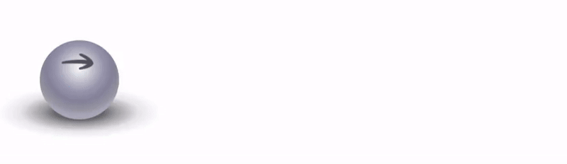
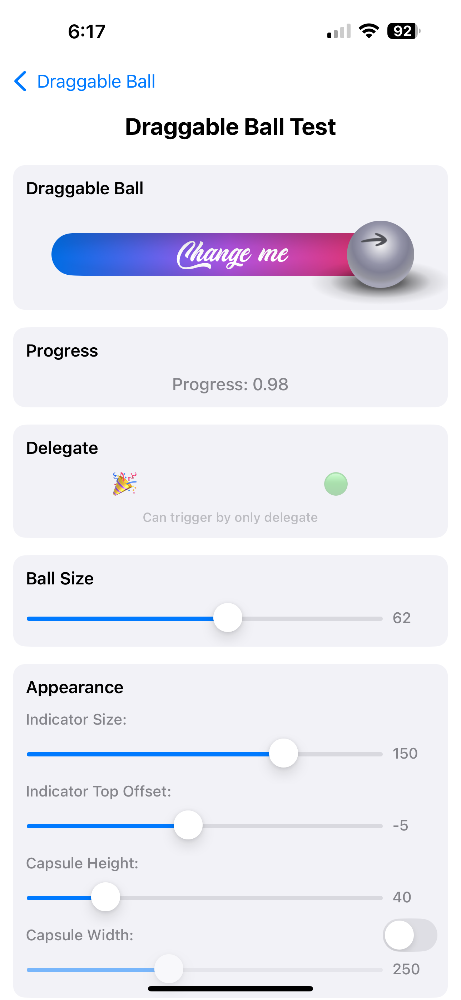
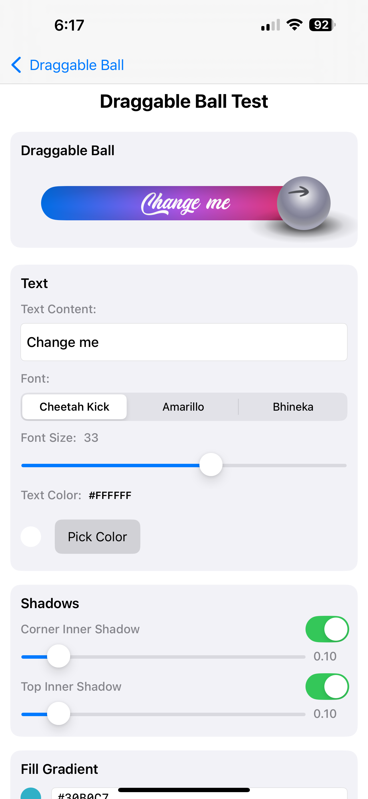

# 🏐 Draggable Ball Animation 

> Swift, UIKit, min. iOS 15.0 

A smooth, interactive ball animation component built with Swift and UIKit. This project demonstrates advanced UI animations, gesture handling, and custom view creation with beautiful gradients and shadows.



## ✨ Features

- **Interactive Dragging**: Smooth ball movement with gesture recognition
- **Real-time Progress**: Live progress tracking with delegate callbacks
- **Hint Animations**: Subtle wiggle animations to guide user interaction
- **Tap Feedback**: Responsive tap animations for enhanced user experience
- **Highly Customizable**: Fonts, colors, shadows, and dimensions

## 📚 Deep Dive Tutorial

Want to understand how this component works under the hood? Check out the comprehensive tutorial articles that explain the entire implementation process:

**🌍 Available in multiple languages:**
- **[English Version - How to Code a Rolling Ball with Swift?](http://zeynepmuslim.blog/post.html?post=draggable-ball-eng%2Fdraggable-ball-eng.md)**
- **[Turkish Version - Swift ile Yuvarlanan Top Nasıl Kodlanır?](http://zeynepmuslim.blog/post.html?post=draggable-ball-tr%2Fdraggable-ball-tr.md)**

The articles cover:
- **Layer-by-layer architecture** breakdown
- **Gesture handling** and animation techniques
- **Gradient and shadow** implementation details
- **Performance optimization** strategies
- **Step-by-step coding** process with explanations

Perfect for developers who want to learn advanced UIKit techniques and understand the thought process behind building complex UI components.

## 🚀 Quick Start

### Basic Implementation

```swift
// Create the draggable ball
let draggableBall = DraggableBall(
    frame: .zero,
    fillText: "Drag Me",
    showCornerInnerShadow: true,
    showTopInnerShadow: true,
    cornerInnerShadowAlpha: 0.2,
    topInnerShadowAlpha: 0.2
)

// Add to your view
view.addSubview(draggableBall)

// Set up constraints
draggableBall.translatesAutoresizingMaskIntoConstraints = false
NSLayoutConstraint.activate([
    draggableBall.centerXAnchor.constraint(equalTo: view.centerXAnchor),
    draggableBall.centerYAnchor.constraint(equalTo: view.centerYAnchor),
    draggableBall.widthAnchor.constraint(equalToConstant: 300),
    draggableBall.heightAnchor.constraint(equalToConstant: 50)
])
```

### Delegate Implementation

```swift
extension YourViewController: DraggableBallDelegate {
    func draggableBall(_ draggableBall: DraggableBall, didUpdateProgress progress: CGFloat) {
        // Handle progress updates
        progressLabel.text = String(format: "Progress: %.2f", progress)
    }
    
    func draggableBallDidReachEnd(_ draggableBall: DraggableBall) {
        // Handle completion
        print("Ball reached the end!")
    }
    
    func draggableBallDidReturnToStart(_ draggableBall: DraggableBall) {
        // Handle reset to start
        print("Ball returned to start")
    }
}
```

## 🛠️ Installation

### Option 1: Copy-Paste
1. Copy `DraggableBall.swift` to your project
2. Add the `arrows.png` image to your Assets.xcassets
3. That's it! No dependencies, no third-party libraries needed

### Option 2: Clone for Testing
1. Clone this repository
2. Open `BallAnimation.xcodeproj` in Xcode
3. Build and run the project to see examples and test different configurations
4. Copy `DraggableBall.swift` to your own project

> **💡 Pure UIKit**: This component uses only native iOS frameworks. No external dependencies, no performance impact, and no increase in app size beyond the single Swift file and one image asset.


## 🎨 Customization

### Colors and Gradients

```swift
// Update fill gradient colors
draggableBall.fillGradientColors = [
    UIColor.systemBlue.cgColor,
    UIColor.systemCyan.cgColor,
    UIColor.systemTeal.cgColor
]
```

### Fonts and Text

```swift
// Update font
draggableBall.updateFont(name: "Cheetah Kick - Personal Use", size: 36, color: .white)

// Update text
draggableBall.updateText("Custom Text")
```

### Shadows

```swift
// Adjust shadow intensity
draggableBall.updateCornerInnerShadow(show: true, alpha: 0.3)
draggableBall.updateTopInnerShadow(show: true, alpha: 0.2)
```

### Programmatic Control

```swift
// Set progress programmatically
draggableBall.setProgress(0.75, animated: true)

// Get current state
let currentProgress = draggableBall.currentProgress
let isCompleted = draggableBall.isCompleted
```

## 📋 Available Methods

### Mutators (Setters)
- `setProgress(_:animated:)` - Set progress with optional animation
- `updateText(_:)` - Change the display text
- `updateFont(name:size:color:)` - Update font properties
- `updateFontColor(_:)` - Change text color
- `updateFontSize(_:)` - Adjust font size
- `updateFillGradientColors(_:)` - Set gradient colors
- `updateCornerInnerShadow(show:alpha:)` - Control corner shadows
- `updateTopInnerShadow(show:alpha:)` - Control top shadows
- `updateBallSize(_:)` - Adjust ball dimensions
- `updateCapsuleHeight(_:)` - Change capsule height

### Accessors (Getters)
- `currentProgress` - Current progress value (0.0 - 1.0)
- `isCompleted` - Boolean indicating if progress >= 0.99

## 🖼️ Test Interface Screenshots

The project includes a comprehensive test interface (`TestDragableVC.swift`) that demonstrates all available methods and customization options:

<div style="display: flex; justify-content: center; gap: 10px;">     </div>

## 📁 Project Structure

```
BallAnimation/
├── DraggableBall.swift              # Main component
├── SingleBallAnimationVC.swift      # Basic example
├── TestDragableVC.swift            # Testing interface
├── Assets.xcassets/                # Images and colors
├── Fonts/                          # Custom fonts
└── Supporting Files/               # App configuration
```

## 🤝 Contributing

Contributions are welcome! Please feel free to:
- Report bugs
- Suggest new features
- Submit pull requests
- Improve documentation

---

Thanks to [@Designownow_](https://x.com/Designownow_) for the original design inspiration that sparked this implementation.
